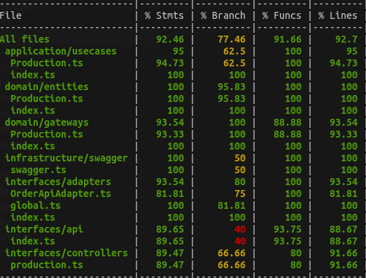
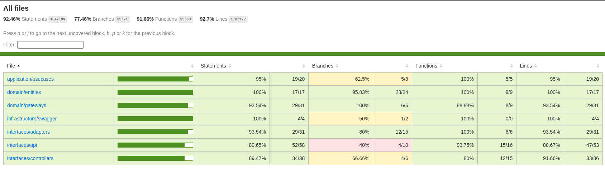

[](https://www.mysql.com/)
   


# Tech Challenge - Fase 04 (GRUPO 31) - Sistema de gestão de pedidos - Microserviço de Produção

Consiste no microserviço de um sistema de gestão de pedidos para produção incluindo as seguintes caracteristicas:

## Caracteristicas

- Endpoint de buscar todos os pedidos em produção
- Endpoint para criar um novo pedido para produção
- Endpoint de buscar um pedido em produção por id
- Endpoint de buscar todos os pedidos em produção por status
- Endpoint para atualizar um status de um pedido emprodução
- Pipeline GitActions Workflow para execução de testes e build da imagem em ECR AWS

## Requisitos para execução direta

- Debian: 11 ou superior | Ubuntu: 20
- Node: 18 ou superior
- Banco de dados Mysql

## Requisitos para execução via docker

- Docker: 20 ou superior
- Docker-compose: 1.29.2 ou superior

## Execução dos testes unitários

- npm run test



Coverage



## Gerar a versão de distribuição /dist ( se necessário )

Executar o comando abaixo para gerar automaticamente o dist
- npm run build

## Execução via docker
A execução da aplicação via docker-compose permite a execução do microserviço com escalabilidade horizontal (via replicas do container).

Para executar o modelo padrão da atividade executando 2 instâncias (1 para aplicação e 1 para o banco de dados), acesse o diretorio onde está o código e digite o comando a seguir:

    docker-compose up

Ele irá provisionar uam instância de banco de dados (mysql) e aplicar um build no Dockerfile para provisionar a instância de aplicação. Em tela irá apresentar o log continuo da execução dos serviços.

Para executar o pacote sem visualizar os log's, execute o comando abaixo:

    docker-compose up -d

Para encerrar o serviço digite o comando a seguir: 

    docker-compose down

## Documentação das API's

A documentação pode ser acessada via browser digitando o endereço abaixo quando a aplicação estiver em execução:

    http://localhost:8082/api-docs/

Para acessar diretamente [clique aqui](http://localhost:8082/api-docs/)

O swagger é um framework composto por diversas ferramentas que, independente da linguagem, auxilia a descrição, consumo e visualização de serviços de uma API REST e foi selecionado para documentação dos endpoints do backend da aplicação.

- PRODUÇÃO (payments)
    - Permite listar todos os pedidos em produção
    - Efetua pedido para produção
    - Permite listar 1 pedido em produção por id
    - Permite listar todos os pedidos em produção por status
    - Permite atualizar o status de um pedido em produção

## Requisitos para jornada de teste

## Jornada de teste

Permite listar todos os pedidos em produção
```
curl --location 'http://localhost:8082/production'
```

Permite listar 1 pedido em produção por id
```
curl --location 'http://localhost:8082/production/{id}'
```

Permite listar todos os pedidos em produção por status
```
curl --location 'http://localhost:8082/production/status/{status}'
```

Efetua pedido para produção
```
curl --location 'http://localhost:8082/production' \
--header 'Content-Type: application/json' \
--data '{
  "orderId": "123456789",
  "protocol": "1",
  "orderDescription": ""
}'

```

Permite atualizar o status de um pedido em produção
```
curl --location 'http://localhost:8082/production/id' \
--header 'Content-Type: application/json' \
--data '{
  "status": "DONE"
}'

```


## Requisitos para teste unitário automatizado via GitActions e BuildImage para registro no ECR AWS

* [Terraform](https://www.terraform.io/) - Terraform is an open-source infrastructure as code software tool that provides a consistent CLI workflow to manage hundreds of cloud services. Terraform codifies cloud APIs into declarative configuration files.
* [Amazon AWS Account](https://aws.amazon.com/it/console/) - Amazon AWS account with billing enabled
* [aws cli](https://aws.amazon.com/cli/) optional

## Antes de começar

Esta execução esta fora do nível gratuito da AWS, importante avaliar antes de executar

## AWS configuração

Com os requisitos já identificados, configure abaixo no secrets do github.

```
AWS_ACCESS_KEY = "xxxxxxxxxxxxxxxxx"
AWS_SECRET_KEY = "xxxxxxxxxxxxxxxxx"
```

## Uso

Com os requisitos já identificados, configure abaixo no secrets do github.

```
   runs-on: ubuntu-latest
    if: github.ref == 'refs/heads/master'
    needs:
      - run-tests

    steps:
    - name: Checkout do repositório
      uses: actions/checkout@v2

    - name: Configurando a AWS Credentials Action para o GitHub Actions
      uses: aws-actions/configure-aws-credentials@v1
      with:
        aws-access-key-id: ${{ secrets.AWS_ACCESS_KEY }}
        aws-secret-access-key: ${{ secrets.AWS_SECRET_KEY }}
        aws-region: ${{ env.AWS_REGION }}
      
    - name: Login em Amazon ECR
      id: login-ecr
      uses: aws-actions/amazon-ecr-login@v1

    - name: Instala dependencias
      run: |
        npm install

    - name: Gera versão de distribuição
      run: |
        npm run build

    - name: Build do Dockerfile, criação da Tag e Push Image em Amazon ECR
      id: build-image
      env:
        ECR_REGISTRY: ${{ steps.login-ecr.outputs.registry }}
      run: |
        docker image build \
        --tag ${{ env.ECR_REGISTRY }}/${{ env.ECR_REPOSITORY }}:latest \
        --tag ${{ env.ECR_REGISTRY }}/${{ env.ECR_REPOSITORY }}:${{ env.SHORT_SHA }} \
        .
        docker push ${{ env.ECR_REGISTRY }}/${{ env.ECR_REPOSITORY }}:latest
        docker push ${{ env.ECR_REGISTRY }}/${{ env.ECR_REPOSITORY }}:${{ env.SHORT_SHA }}
        echo ${{ steps.login-ecr.outputs.registry }}
```

### Execução do projeto

Ao efetuar um push no repositório develop com sucesso, é necessário efetuar um pull request na branch master para que a execução do pipeline do workflow seja executado
